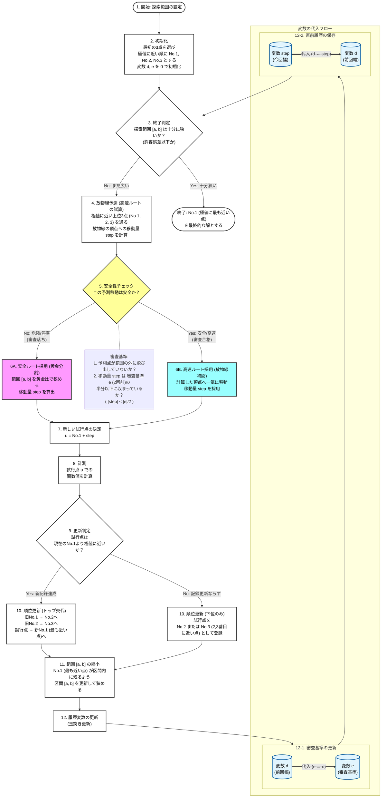

```mermaid
flowchart TD
    Start(["1. 開始: 探索範囲の設定"]) --> Init["2. 初期化<br>最初の3点を選び<br>極値に近い順に No.1, No.2, No.3 とする<br>変数 d, e を 0 で初期化"]
    
    Init --> LoopStart{"3. 終了判定<br>探索範囲 [a, b] は十分に狭いか？<br>(許容誤差以下か)"}
    
    LoopStart -- Yes: 十分狭い --> End(["終了: No.1 (極値に最も近い点)<br>を最終的な解とする"])
    LoopStart -- No: まだ広い --> CalcParabola["4. 放物線予測 (高速ルートの試算)<br>極値に近い上位3点 (No.1, 2, 3) を通る<br>放物線の頂点への移動量 step を計算"]

    CalcParabola --> CheckCondition{"5. 安全性チェック<br>この予測移動は安全か？"}
    
    note_cond["審査基準:<br>1. 予測点が範囲の外に飛び出していないか？<br>2. 移動量 step は 審査基準 e (2回前)の<br>半分以下に収まっているか？<br>( |step| < |e|/2 )"]
    CheckCondition -.- note_cond

    CheckCondition -- No: 危険/停滞<br>(審査落ち) --> GoldenSec["6A. 安全ルート採用 (黄金分割)<br>範囲 [a, b] を黄金比で狭める<br>移動量 step を算出"]
    CheckCondition -- Yes: 安全/高速<br>(審査合格) --> SPI["6B. 高速ルート採用 (放物線補間)<br>計算した頂点へ一気に移動<br>移動量 step を採用"]

    GoldenSec --> CalcU["7. 新しい試行点の決定<br>u = No.1 + step"]
    SPI --> CalcU

    CalcU --> Eval["8. 計測<br>試行点 u での<br>関数値を計算"]
    
    Eval --> UpdateSelect{"9. 更新判定<br>試行点は<br>現在のNo.1より極値に近いか？"}
    
    UpdateSelect -- Yes: 新記録達成 --> UpdateBest["10. 順位更新 (トップ交代)<br>旧No.1 → No.2へ<br>旧No.2 → No.3へ<br>試行点 → 新No.1 (最も近い点)へ"]
    UpdateSelect -- No: 記録更新ならず --> UpdateOthers["10. 順位更新 (下位のみ)<br>試行点を<br>No.2 または No.3 (2,3番目に近い点) として登録"]

    UpdateBest --> Shrink["11. 範囲 [a, b] の縮小<br>No.1 (最も近い点) が区間内に残るよう<br>区間 [a, b] を更新して狭める"]
    UpdateOthers --> Shrink

    %% ---------------------------------------------------------
    %% Step 12: 履歴更新の視覚化
    %% ---------------------------------------------------------
    
    Shrink --> UpdateProcess["12. 履歴変数の更新<br>(玉突き更新)"]

    subgraph AssignProcess [変数の代入フロー]
        direction TB
        
        subgraph Step12_1 [12-1. 審査基準の更新]
            direction LR
            Var_d_old[("変数 d<br>(前回幅)")] == "代入 (e ← d)" ==> Var_e_new[("変数 e<br>(審査基準)")]
        end
        
        subgraph Step12_2 [12-2. 直前履歴の保存]
            direction LR
            Var_step[("変数 step<br>(今回幅)")] == "代入 (d ← step)" ==> Var_d_new[("変数 d<br>(前回幅)")]
        end
        
        Step12_1 --> Step12_2
    end

    UpdateProcess --> Step12_1
    Step12_2 --> LoopStart

    %% スタイリング
    classDef golden fill:#f9f,stroke:#333,stroke-width:2px,color:black;
    classDef spi fill:#9ff,stroke:#333,stroke-width:2px,color:black;
    classDef cond fill:#ff9,stroke:#333,stroke-width:2px,color:black;
    classDef main fill:#fff,stroke:#333,stroke-width:2px,color:black;
    classDef variable fill:#e1f5fe,stroke:#01579b,stroke-width:2px,color:black; 

    class GoldenSec golden;
    class SPI spi;
    class CheckCondition cond;
    class Start,Init,End,LoopStart,CalcParabola,CalcU,Eval,UpdateSelect,UpdateBest,UpdateOthers,Shrink,UpdateProcess main;
    
    %% 変数ノードのスタイル適用
    class Var_d_old,Var_e_new,Var_step,Var_d_new variable;
```